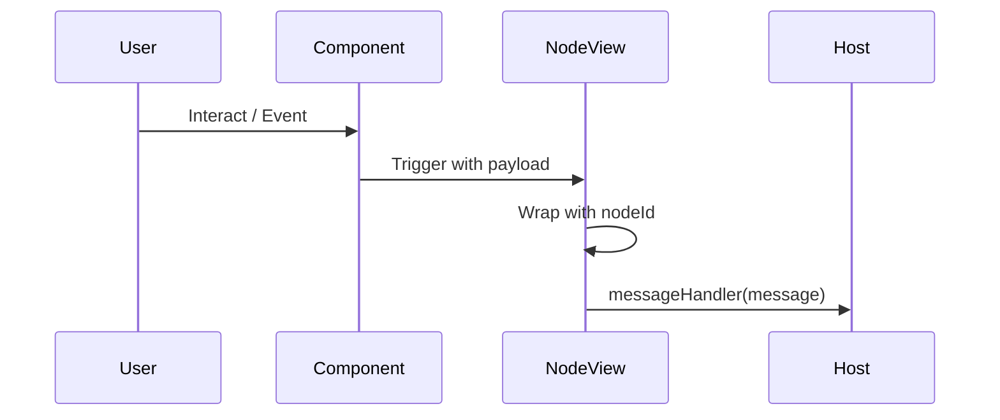
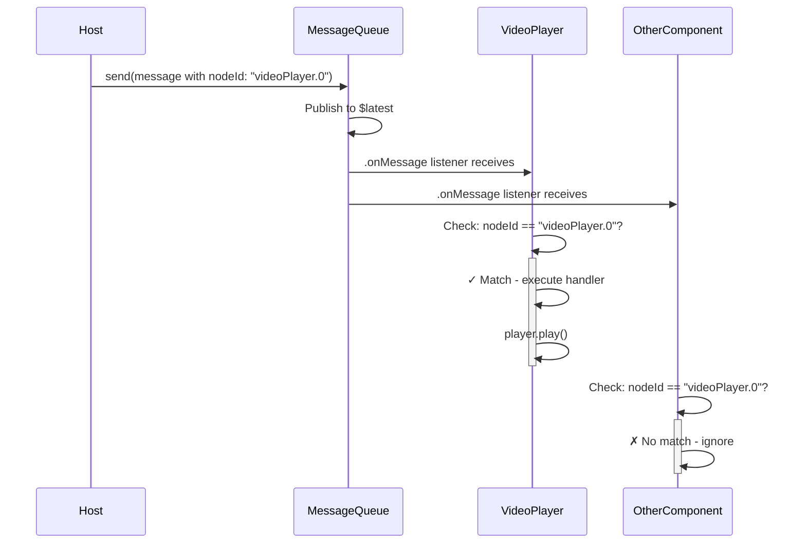

# Messages

**Bidirectional communication between host applications and rendered components.**

## Overview

SwiftUIML renders UI from data — whether that data comes from a remote server, a local database, an embedded JavaScript runtime, or anywhere else. But UI isn't just display — users tap buttons, fill in forms, and interact with components. Messages are how those interactions flow back to your app logic, and how your app logic can control rendered components in return.

SwiftUIML supports two-way messaging:
- **Outbound (Component -> Host):** User interactions, lifecycle events, state changes
- **Inbound (Host -> Component):** Control commands, data updates, configuration changes

## Outbound Messages

Components send messages to the host application via the `messageHandler` closure. NodeView automatically wraps messages with context:

```swift
{
  "message": <original payload>,
  "context": {
    "nodeId": "Component.0",
    // ... component-specific fields
  }
}
```

### Parsing Messages

```swift
NodeView(node) { message in
  guard
    let messageDict = message.dict,
    let context = messageDict[.context]?.dict,
    let nodeId = context[.nodeId]?.string
  else {
    return
  }
  let payload = messageDict[.message]
  // Handle message
}
```

### Common Components

**Button:**
```swift
ButtonNode("Tap Me", onTap: "button.tapped")
```
```json
{"message": "button.tapped", "context": {"nodeId": "Button.0"}}
```

**TextField:**
```swift
TextFieldNode("Name", text: name, onTextChange: "text.changed")
```
```json
{
  "message": "text.changed",
  "context": {
    "nodeId": "TextField.0",
    "text": "New Value",
    "oldText": "Old Value"
  }
}
```

**Lifecycle:**
```swift
VStackNode { ... }
  .onAppear(message: "vstack.appeared")
  .onDisappear(message: "vstack.disappeared")
```

### Message Flow



## Inbound Messages

The host application can send messages to components using `MessageQueue`.

### Setup

```swift
struct ContentView: View {
  let messageQueue = MessageQueue()

  var body: some View {
    NodeView(node) { message in
      handleOutboundMessage(message)
    }
    .environment(\.messageQueue, messageQueue)
  }

  func controlComponent() {
    messageQueue.send(.dict([
      .nodeId: .string("videoPlayer.0"),
      .message: .string("play")
    ]))
  }
}
```

### Receiving Messages

Components use `.onMessage(nodeId:)`:

```swift
struct VideoPlayerView: View {
  let node: Node
  @State private var player: AVPlayer?

  var body: some View {
    VideoPlayer(player: player)
      .onMessage(nodeId: node.id) { message in
        switch message.string {
        case "play": player?.play()
        case "pause": player?.pause()
        default: break
        }
      }
  }
}
```

### Targeted vs Broadcast

**Targeted:**
```swift
messageQueue.send(.dict([
  .nodeId: .string("player.0"),  // Only player.0 receives
  .message: .string("play")
]))
```

**Broadcast (omit nodeId):**
```swift
messageQueue.send(.dict([
  .message: .string("pause")  // All listeners receive
]))
```

### Message Routing



## Bidirectional Example

Here's a custom video player renderer that uses both directions: the host app can send "play" and "pause" commands via `MessageQueue`, and the component reports playback state changes back to the host via `messageHandler`. This pattern works well for any component where the host needs both control and visibility into component state.

```swift
struct VideoPlayerView: View {
  let node: Node
  let messageHandler: MessageHandler?
  @State private var player = AVPlayer()

  var body: some View {
    VideoPlayer(player: player)
      .onMessage(nodeId: node.id) { message in
        // Inbound: Host -> Component
        switch message.string {
        case "play": player.play()
        case "pause": player.pause()
        default: break
        }
      }
      .onPlaybackStateChange { isPlaying in
        // Outbound: Component -> Host
        messageHandler?(.dict([.custom("isPlaying"): .bool(isPlaying)]))
      }
  }
}
```
