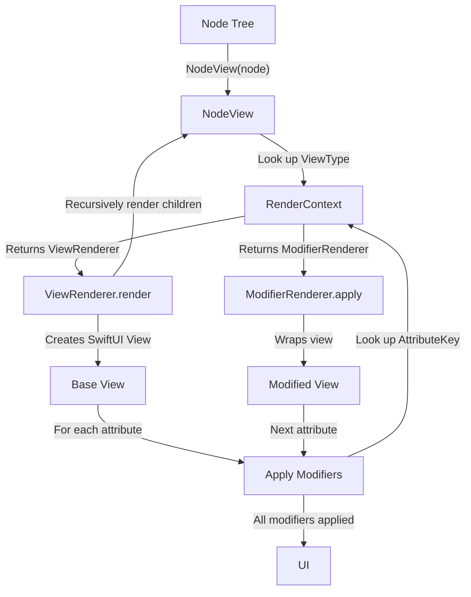

# SwiftUIML

**Data-driven SwiftUI rendering.**
Define UI as data, render it as native SwiftUI.

SwiftUIML lets you describe your UI as a simple tree of nodes - in Swift, TypeScript, or raw JSON - and render it as fully native SwiftUI. This is useful when your UI needs to change without shipping a new app version: server-driven interfaces, A/B tests, CMS-managed layouts, or any scenario where UI structure is determined at runtime rather than compile time.

**Includes:**
- Swift Package Manager DSL (platform agnostic) for building layouts
- Swift Package Manager library for iOS rendering
- TypeScript DSL package for building layouts (`TypeScript/`)
- Example application with node server and iOS app (`Example/`)

## Quick Start

```swift
import SwiftUIML

// Decode JSON
let node = try JSONDecoder().decode(Node.self, from: jsonData)

// Render it
struct ContentView: View {
  var body: some View {
    NodeView(node) { message in
      print("User action:", message)
    }
  }
}
```

Or use the DSL directly:
```swift
struct ContentView: View {
  var body: some View {
    NodeView {
      VStackNode(spacing: 20) {
        TextNode("Hello World").bold()
        ButtonNode("Tap Me", onTap: "buttonTapped")
          .padding(16)
      }
    }
  }
}
```

## Core Concepts

### Node Tree
UI is represented as a tree of `Node` objects with:
- **type**: View type (Text, VStack, Button, etc.)
- **attributes**: Properties and modifiers (text, padding, color, etc.)
- **children**: Child nodes (optional)

### Declarative Everything
- **Modifiers**: `.padding(20)`, `.bold()`, `.foregroundColor("red")`
- **Containers**: `VStack`, `HStack`, `ZStack`, `ScrollView`, `LazyVStack`
- **Views**: `Text`, `Button`, `Image`, `AsyncImage`, shapes, gradients
- **Messaging**: User taps button -> message passed through closure

Client renders:
- Native SwiftUI views
- Smooth animations
- Platform-appropriate interactions

## DSL Examples

```swift
VStackNode(spacing: 16, alignment: .leading) {
  TextNode("Welcome").font(.title).bold()
  HStackNode {
    ImageNode(systemName: "star.fill")
      .foregroundColor("yellow")
    TextNode("Featured")
  }
  ButtonNode("Continue", onTap: "continue")
    .padding(16)
    .background(ColorNode("blue"))
    .cornerRadius(8)
}
```

Complex layouts:
```swift
ScrollViewNode(.vertical) {
  LazyVStackNode(spacing: 12) {
    ForEach(items) { item in
      HStackNode {
        AsyncImageNode(url: item.imageURL)
          .frame(width: 60, height: 60)
          .cornerRadius(8)
        VStackNode(alignment: .leading) {
          TextNode(item.title).bold()
          TextNode(item.subtitle).foregroundColor("gray")
        }
        Spacer()
      }
      .padding(12)
      .background(ColorNode("white"))
      .cornerRadius(12)
      .shadow(radius: 2)
    }
  }
}
```

## JSON Format

Since nodes are just data, they serialize naturally to JSON. Attributes are stored as 2D arrays for order preservation (deserialized as `OrderedMultiDictionary` for O(1) lookup, supporting duplicate keys):

```json
{
  "type": "VStack",
  "attributes": [["spacing", 20], ["alignment", "center"]],
  "children": [
    {
      "type": "Text",
      "attributes": [["text", "Hello"], ["bold", true]]
    }
  ]
}
```

Nested nodes use `$type` discriminator:

```json
{
  "type": "Button",
  "attributes": [
    ["title", "Tap"],
    ["background", {
      "$type": "node",
      "type": "Color",
      "attributes": [["value", "blue"]]
    }]
  ]
}
```

## TypeScript DSL

Build layouts from TypeScript/Node.js with a fluent API. See [TypeScript/README.md](TypeScript/README.md) for installation and usage.

**Example Application:**

See [Example/README.md](Example/README.md) for a complete demo with node server + iOS app.

## Advanced Features

### Styles & Layouts
Define reusable styles and resolve them:

```swift
let layout = Layout(
  styles: [
    "primary": [.foregroundColor: "blue", .bold: true],
    "card": [.padding: 20, .background: ColorNode("white")]
  ],
  content: VStackNode {
    TextNode("Title").style("primary")
    TextNode("Body").style("card")
  }
)

let resolved = layout.resolve() // Styles merged into nodes
```

### Stable IDs
Auto-generate deterministic IDs:

```swift
let tree = VStackNode {
  TextNode("Hello") // Gets id: "Text.0"
  TextNode("World") // Gets id: "Text.1"
}.addingStableIds()
```

### Responsive Design
```swift
TextNode("Hello")
  .responsive([
    .sm: [.font: [.fixedSize: 14]],
    .md: [.font: [.fixedSize: 18]],
    .lg: [.font: [.fixedSize: 24]],
  ])
```

### Color Scheme Support
```swift
TextNode("Title")
  .colorSchemeConditional([
    .light: [.foregroundColor: "#000000"],
    .dark: [.foregroundColor: "#FFFFFF"],
  ])
```

## Architecture

Under the hood, SwiftUIML maps each node type to a native SwiftUI renderer and applies modifiers in order. The system is designed to be extended - you can add custom view types and modifiers without touching the core.

### Core Components
- **Node**: Immutable data structure (type, attributes, children)
- **NodeView**: Main rendering component
- **ViewRenderer**: Renders specific view types (Text, VStack, etc.)
- **ModifierRenderer**: Applies modifiers (padding, color, etc.)
- **RenderContext**: Registry of all renderers (extensible)

### Extension Pattern
Add custom views and modifiers:

```swift
// Custom modifier renderer
struct CustomModifierRenderer: ModifierRenderer {
  static let key: AttributeKey = .custom("myModifier")

  static func apply(to view: any View, node: borrowing Node, value: AttributeValue, messageHandler: MessageHandler?) -> (any View)? {
    // Custom rendering logic
    return view.overlay(Text(value.string ?? ""))
  }
}

// Register with context
let context = RenderContext.default.with(CustomModifierRenderer.self)

// Use in view
NodeView(node)
  .environment(\.renderContext, context)
```

Add custom DSL methods:
```swift
public extension Node {
  func myModifier(_ value: String) -> Node {
    addingAttribute(.custom("myModifier"), value: .string(value))
  }
}

// Use it
TextNode("Hello").myModifier("custom value")
```

### Rendering Flow



### Messaging

SwiftUIML supports bidirectional messaging:

**Outbound (Component -> Host):** Components send user interactions and events to the host via `messageHandler`. NodeView wraps messages with context (nodeId, component-specific fields).

```swift
NodeView(node) { message in
  guard let nodeId = message.dict?[.context]?.dict?[.nodeId]?.string else { return }
  print("Message from \(nodeId): \(message)")
}
```

**Inbound (Host -> Component):** The host sends commands to specific components via `MessageQueue`. Components listen with `.onMessage(nodeId:)`.

```swift
let messageQueue = MessageQueue()

NodeView(node)
  .environment(\.messageQueue, messageQueue)

// Control a specific component
messageQueue.send(.dict([
  .nodeId: .string("player.0"),
  .message: .string("play")
]))
```

See **[Messages Guide](Docs/Messages.md)** for detailed patterns and examples.


## Testing

See **[Testing Guide](Docs/Testing.md)** for detailed information about the multi-language test infrastructure.

```bash
make test           # Full suite: Core + Snapshots + TypeScript + Cross-validation
make coretest       # SwiftUIMLCore only (data model, DSL, serialization)
make snapshottest   # Swift DSL snapshot tests
make tssnapshottest # TypeScript DSL cross-validation
make tstest         # TypeScript unit tests
```

**Prerequisites:** iOS 18.5 simulator, [xcbeautify](https://github.com/cpisciotta/xcbeautify)

## Installation

Add to your `Package.swift`:
```swift
dependencies: [
  .package(url: "https://github.com/pixelrevision/SwiftUIML.git", from: "0.1.0")
]
```

**For iOS apps (with SwiftUI rendering):**
```swift
.target(
  name: "YourApp",
  dependencies: [
    .product(name: "SwiftUIML", package: "SwiftUIML")
  ]
)
```

**For server-side Swift / Linux (DSL only):**
```swift
.target(
  name: "YourServer",
  dependencies: [
    .product(name: "SwiftUIMLCore", package: "SwiftUIML")
  ]
)
```

## Platform Support

- **Minimum:** iOS 17+, macOS 14+, Swift 5.9+
- **Development/Testing:** iOS 18.5 simulator required for snapshot tests
- **SwiftUIMLCore** (data model & DSL): iOS 17+, macOS 14+, Linux
- **SwiftUIML** (rendering): iOS 17+ only (requires SwiftUI)

## Design Principles

1. **Data-driven UI** - Views are functions of data
2. **Declarative** - Attribute presence drives behavior
3. **Immutable data** - All modifications return new instances
4. **Type-safe** - Strong typing throughout
5. **Extensible** - Custom views and modifiers via renderer pattern
6. **JSON-serializable** - Wire format is simple, order-preserving JSON
7. **Low Dependency Count** - Prioritization on only importing what's needed for a project.  Only external dependencies are snapshot test helpers.

## Use Cases

- **Dynamic UIs**: A settings screen or onboarding flow that changes structure at runtime - from a server, a local config, or an embedded script - without requiring an app update.
- **A/B testing**: Serve different UI layouts to different user segments and measure engagement, controlled from the backend.
- **Personalization**: Deliver user-specific layouts - a dashboard that adapts to each user's role, preferences, or subscription tier.
- **CMS-driven**: Let a content team compose and publish app screens (e.g., promotional pages, feature announcements) without developer involvement.
- **Rapid iteration**: Update UI logic during development or internal testing without waiting for a full build cycle.
- **Embedded scripting**: Pair with an embedded JavaScript runtime (e.g., JavaScriptCore) to generate and update UI on-device between App Store releases.

## Documentation

- **[Testing Guide](Docs/Testing.md)** - Multi-language test infrastructure and validation
- **[Design Documentation](Docs/Design.md)** - Architecture and design decisions
- **[Messages Guide](Docs/Messages.md)** - Info on messages and how they fit in with SwiftUIML
- **[Environment Guide](Docs/Environment.md)** - Info on using the SwiftUI environment to setup custom renderers. 

## Contributing

See [CONTRIBUTING.md](CONTRIBUTING.md) for guidelines.

## License

[MIT](LICENSE)

## Status

**Experimental.** API may change across minor versions. If you depend on specific rendering output, pin your version and use snapshot tests.

See [ROADMAP.md](ROADMAP.md) for planned work.
